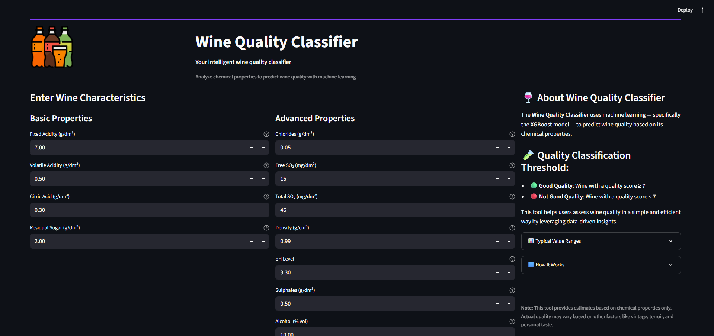

# 🍷 Wine Quality Predictor

A simple web app that predicts whether a wine sample is **Good** or **Not Good** based on its chemical properties, using a machine learning model.



## ✨ Features

- Clean, responsive web interface
- Predicts wine quality instantly
- Displays model confidence score
- User-friendly input sliders for chemical attributes

## ➡️ Try it Out!

https://bhax1-wine-quality-classifier-app-7cfzoa.streamlit.app/

## 🚀 How to Run Locally

```bash
git clone https://github.com/bhax1/wine-quality-classifier.git
cd wine-quality-classifier
pip install -r requirements.txt
streamlit run app.py
# If that doesn't work, try:
python -m streamlit run app.py